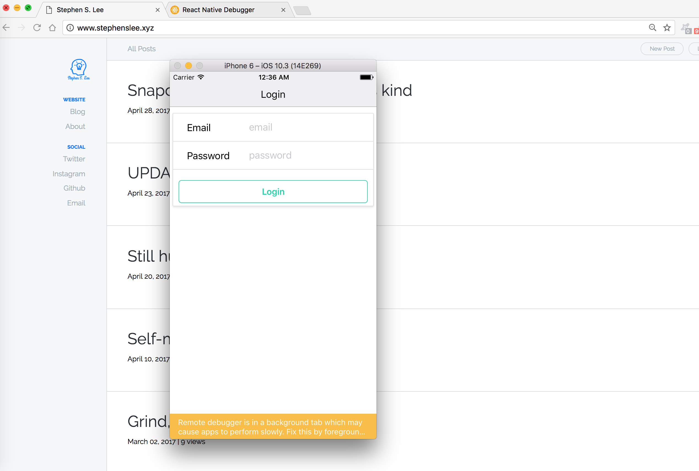

# manager
React Native Application

### Setup
```
$ npm install --save react-redux redux
$ npm install --save firebase
```

basic setup
```js
import {
  AppRegistry,
} from 'react-native';
import App from './src/App';

AppRegistry.registerComponent('manager', () => App);
```

### Handling Form Updates
1. User types something
2. Call Action Creator with new text
3. Action Creator returns an action
4. Action sent to all reducers
5. Reducer calculates new app state
6. State sent to all components
7. Component rerender with new state

### Types.js
```
_________               ____________               ___________
|         |             |            |             |           |
| Reducer |<------------| Types.js   |------------▶|  Action   |
|_________|             |____________|             |___________|
                        * EMAIL_CHANGED = 'email_changed'
                        * PASSWORD_CHANGE = 'password_changed'
```

```js
export const EMAIL_CHANGED = 'email_changed'; // did not use export default because there are many other types that will be exported in a file.
```

### Proposed State
1. Email
When user types something on a email field
2. Password
When user types something on a password field
3. Loading
True when we start our auth process, false when it completes
4. Error
Default to empty string. Throw an error when auth is failed
5. User
Default to null. Put in the user model when we successfully auth.

### Login User
* When `login` button is tapped, call `loginUser` action creator with email and password.
* Action creator makes request to log user in.



### Async. Action Creator
1. Call to Action Creator
2. Action Creator runs
3. Request to firebase is made -> request complete and we can return action
4. WE have nothing to return  

### Redux Thunk
```
$ npm install --save redux-thunk
```

### Action Creator Rules with Thunk
* Action Creators return an action
* Action Creators return a function that is called with 'dispatch'

### Handling email and password login & signup & error handling with Firebase
```js
firebase.auth().signInWithEmailAndPassword(email, password)
.then(user => loginUserSuccess(dispatch, user))
.catch(() => {
  firebase.auth().createUserWithEmailAndPassword(email, password)
  .then(user => loginUserSuccess(dispatch, user))
  .catch(() => loginUserFail(dispatch));
});
```

### React Native Router Flux (handling navigation)
```
$ npm install --save react-native-router-flux@3.38.0 # make sure you install version 3.38.0 without ^ in the front.
                                              # Removing that symbol forces npm install to install the version indicated instead of the newest version.

```

Check out https://github.com/aksonov/react-native-router-flux/blob/master/docs/API_CONFIGURATION.md

### How Scene works
```js
<Scene
  key='login' //call `Actions.login` to show this screen
  component={LoginForm} //show the component `loginForm`
  title='Login' // make a new navbar and give a title 'Login'
  initial // this is a first screen to show
/>
```
### ES6 Key Interpolation
```js
// es6
//...
const { prop, value } = action.payload;
return { ...state, [prop]: value };
//...
// without using Key Interpolation
const { prop, value } = action.payload;
state[prop] = value;
return { ...state};
```

### React Native Style Overriding
```js

<CardSection style={{ flexDirection: 'column' }}>
//...
//...

// if there exists style from props, then override it to the one on left inside the array.
<View style={[styles.containerStyle, props.style]}>
  {props.children}
</View>
```

### Firebase rules
```
# allow to read or write if auth's uid matches with users'
{
  "rules": {
    "users": {
      "$uid": {
      ".read": "$uid === auth.uid",
    	".write": "$uid === auth.uid"
      }
    }
  }
}
```
### Create data into Firebase
```js
export const employeeCreate = ({ name, phone, shift }) => {
  // console.log(name, phone, shift); //check if this action is working.
  const { currentUser } = firebase.auth();
  return () => {
    firebase.database().ref(`/users/${currentUser.uid}/employees`)
      .push({ name, phone, shift }) //create a employee object
      .then(() => Actions.employeeList()); // redirects to the employeeList
  };
};
```

### Use lodash to convert object to array
```js
//npm install --save lodash
```
